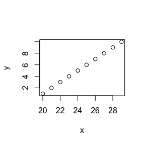

# Class 4
Melanie Ang  
2017-09-14  

## This is my header

This is a line

# This is level 1 header
- bullet 1
- test 2


```r
x <- c(20:29)
y <- c(1:10)
plot(x, y)
```

<!-- -->


```r
summary(x)
```

```
##    Min. 1st Qu.  Median    Mean 3rd Qu.    Max. 
##   20.00   22.25   24.50   24.50   26.75   29.00
```

